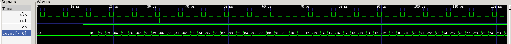
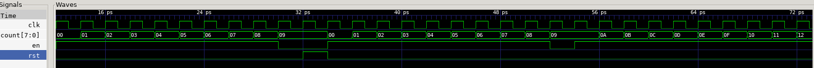
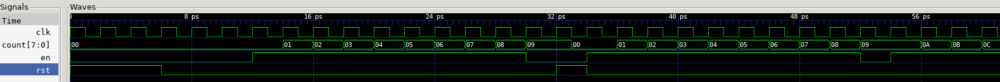

# Initialising the counter
## Trace as seen from gtkwave


Since WIDTH is specified to be 8, this is an 8 bit binary counter.
On the rising edge of the clock, if reset is 0 and EN is 1, then the counter increases by 1 bit. When it reaches 1111111, then it resets back to 00000000.

## Syntax to take note off
- width is set to 8 bits using parameter WIDTH
- always_ff @ (posedge clk) is the way to specify a clocked circuit
- <= are no-bllock assignments used within an always_ff block. it means GET
- {WIDTH{1'b0}} uses concaternation operator to form WIDTH bits of '0'

In line 13 of the code, 
```count <= count + {{WIDTH-1{1'b0}}, en}``` which means that 7 bits of 0 are concatenated with en which is the LSB. This is added to 8 bit count. Hence, this is simple 8 bit output.

# Challenge
1. Introducing a 3 bit delay into the counter upon reaching 0x9

System Verilog file = counter_challenge.sv
Testbench file = counter_challenge_tb.cpp
Shell script = dochallenge.sh

In testbench file, 2 new variables are introduced:
- int pause = 3
- include simulation input top->count

in for loop for clock cycles, when top->count reaches 0x9 and pause is larger than 0, the counter enable (top->en) is set to 0 such that the count is not incremented for that clock cycle. 
When pause reaches 0, the pause variables is reset to 3. top->en is set to 1 such that the counter returns to normal behavior.

2. Adding asynch reset to counter
In system verilog file, the always_ff inputs are adjusted to include both posedge clk and posedge rst.

As seen, the reset is no longer synced to clock cycle and upon the next clock cycle, the counter considers the condition that rst is 0 and hence resets.